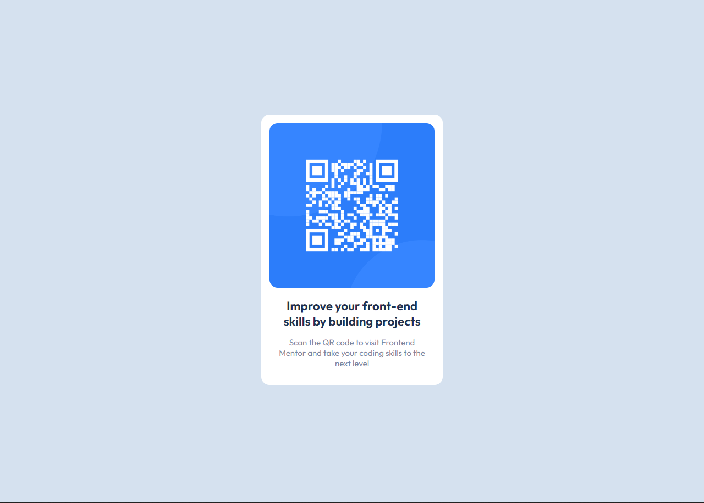

# Frontend Mentor - QR code component



## Welcome! 👋

- Thanks for checking out this project made for a front-end coding challenge.

- [Frontend Mentor](https://www.frontendmentor.io) challenges help you improve your coding skills by building realistic projects.

**To do this challenge, you need a basic understanding of HTML and CSS.**

## The challenge

- My challenge was build out this QR code component and get it looking as  close to the design provided by Frontend Mentor as possible.

## My solution

 ```html
    <div class="container">
    <div class="box">
      
      <h1>Improve your front-end skills by building projects</h1>
      <p>Scan the QR code to visit Frontend Mentor and take your coding skills to the next level</p>
    </div>
  </div>
  ```
  ```css
    @charset "UTF-8";

    @import url('https://fonts.googleapis.com/css2?family=Outfit:wght@400;700&display=swap');

    *{
    margin: 0;
    padding: 0;
    }

    body{
    background-color: #D5E1EF;
    }


    .container{
    display: flex;
    justify-content: center;
    align-items: center;
    height: 100vh;
    }

    .box{
    width: 300px;
    background-color: white;
    text-align: center;
    padding: 15px;
    border-radius: 15px;
    font-family: 'Outfit', sans-serif;
    }

    .box > h1{
    font-size: 22px;
    margin: 15px;
    color: #1f3251;
    }

    .box > p{
    font-size: 15px;
    margin: 15px;
    color: #7b879d;
    }

    img{
    width: 300px;
    height: 300px;
    border-radius: 15px;
    }
```


## Links

- Live Site URL: https://lucas-brisolla.github.io/qr-code-component-main/

## Built with

- Semantic HTML5 markup
- CSS custom properties
- Flexbox

